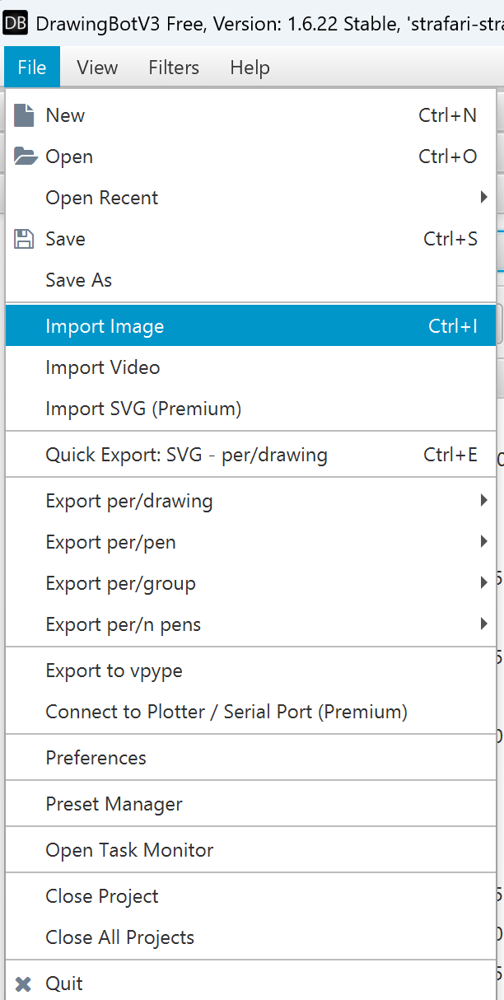
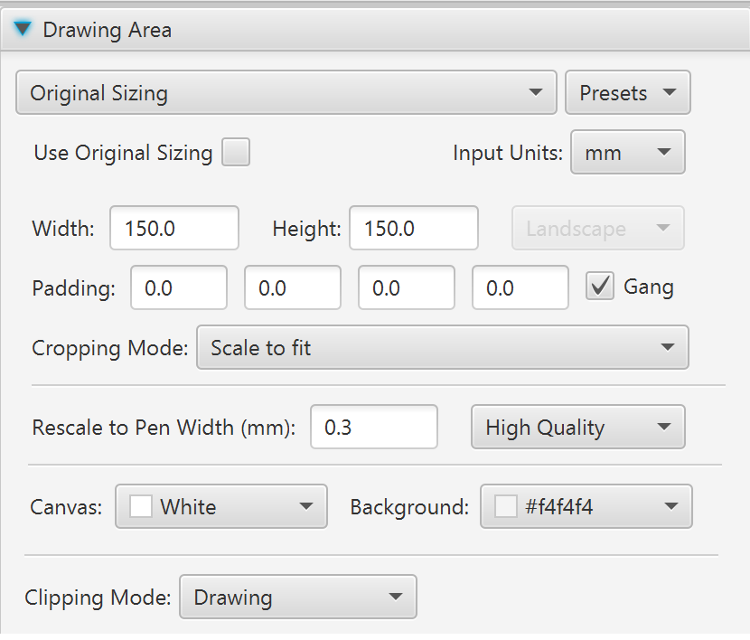
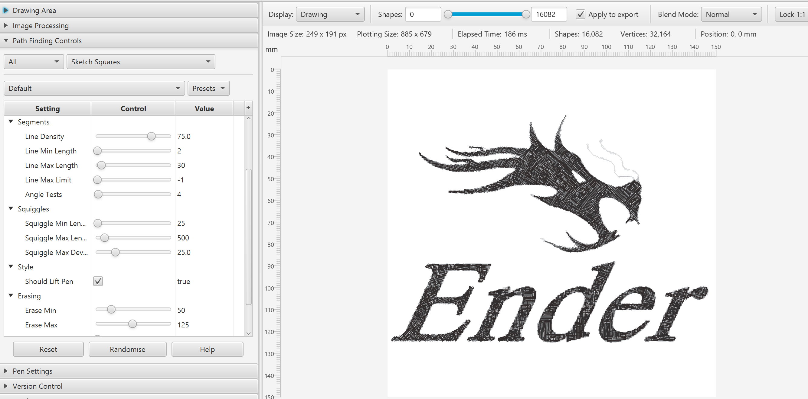
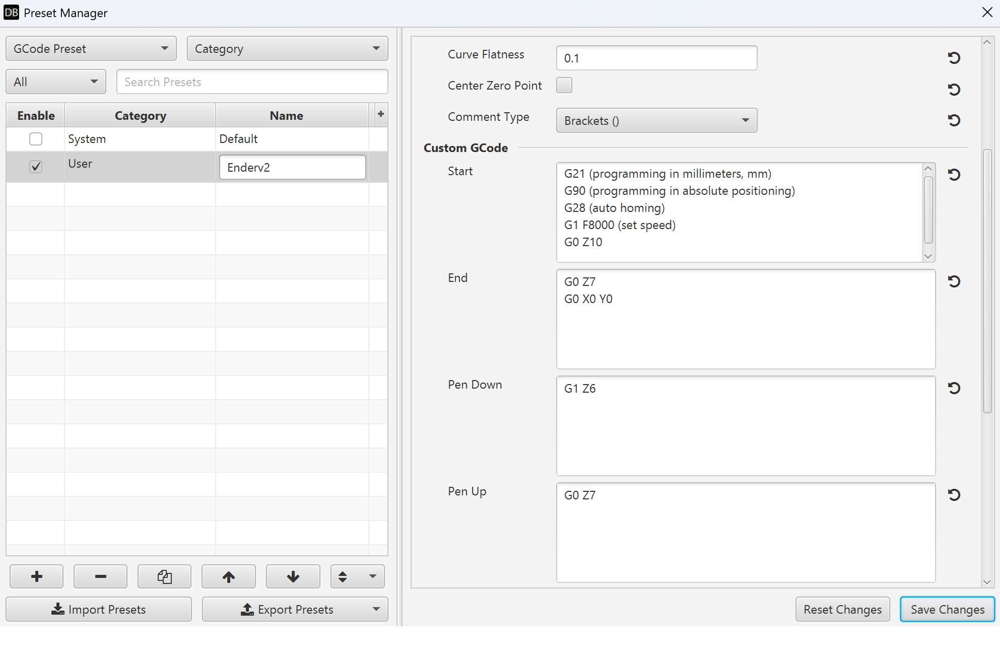
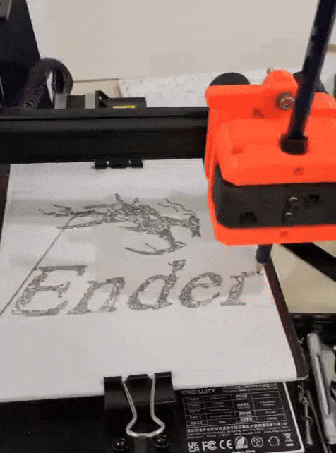
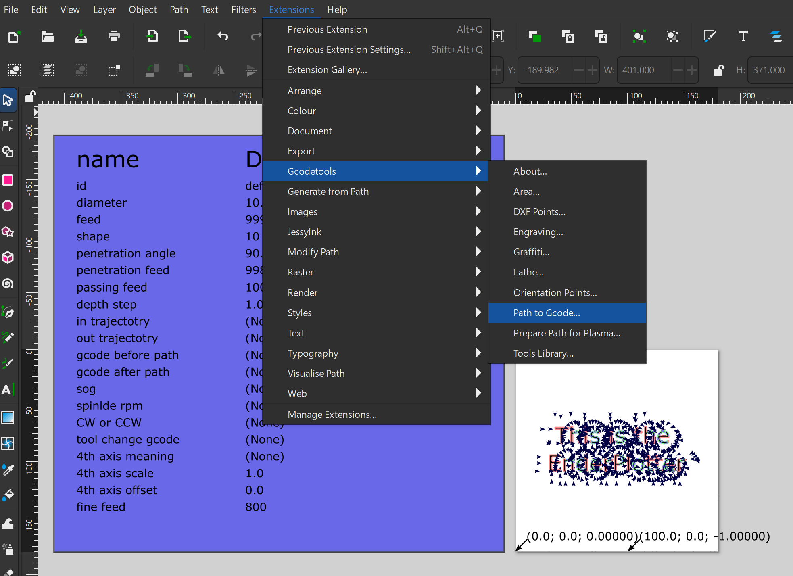

# Plotter Tool for Ender Printer

<!-- Table of Contents -->
- [Introduction](#introduction)
- [Key Features](#key-features)
- [Quick Start](#quick-start)
- [Hardware Requirements](#hardware-requirements)
- [Assembly Instructions](#assembly-instructions)
- [First Drawing with Python](#first-drawing-with-python)
- [Generate G-code from Drawing](#generate-g-code-from-drawing)
- [Generate Drawing with Inkscape](#generate-drawing-with-inkscape)
- [Troubleshooting](#troubleshooting)
- [Contributing](#contributing)
- [License](#license)

## Introduction

This repo is an adaptation of the pltr V2 toolhead.  
We adapted it to be compatible with the EnderScope project (link to website). It is compatible with Ender 2 and Ender 3.  The 3D files to print are:
- ender_base.stl 
- tool_holder_2.stl or tool_holder_3.stl de
- pltr_v2_stamps.stl

Follow the following original instructions to assemble the plotter. 

## Key Features
- Compatible with Ender 2 and Ender 3
- Easy assembly with 3D printed parts
- Supports Python and Inkscape workflows
- Open-source and community supported

## Quick Start
1. Print the required 3D parts.
2. Assemble the toolhead as per instructions.
3. Install [enderscopy](https://github.com/mutterer/enderscopy/) Python library.
4. Run the provided Jupyter notebook to make your first drawing.

## Hardware Requirements

- 2x [M3x40 Bolt](https://www.mcmaster.com/91292A024)
- 2x [M3 Locking Nut](https://www.mcmaster.com/90576A102)
- 3x [M3x10 Flathead Bolt](https://www.mcmaster.com/92125A130)
- 4x [M4x15 Mushroom Cap Bolt](https://www.mcmaster.com/92095A125)
- 2x [Springs](https://www.mcmaster.com/9657K627)
- 4x [Binder Clips](https://amzn.to/3lKdcdM)
- 1x [2mm Allen Key](https://www.mcmaster.com/7289A12)
- 1x [2.5mm Allen Key](https://www.mcmaster.com/7289A13)

The pltr has four mounting points: two fixed and two spring-loaded, so you can experiment with a wide variety of writing implements, pens, brushes, and more!

Designed and manufactured in Charlotte, North Carolina using [GreenGate3D recycled PETG](https://greengate3d.com/?ref=fpowfUvprmSUI).

Read about the [pltr v2 on 3DWithUs](https://3dwithus.com/pltr-pen-plotter-toolhead-for-3d-printers-3d-art-images).

## Assembly Instructions
A 3D Printable Pen Plotter Toolhead for the Creality Ender 3 3D Printer

**Originally launched as a [product on Tindie](https://www.tindie.com/products/andrew_sink/pltr-v2-pen-plotter-toolhead/), the developper since decided to release it for free! If you still want to support this project, you can [buy the developper a coffee on Ko-Fi!](https://ko-fi.com/andrewsink)**

[Installing the pltr is simple](https://youtu.be/c1Wo9KkZKNQ), and only requires three flathead bolts to attach to your printer. 

The [User Guide .PDF](https://github.com/AndrewSink/pltr/blob/main/pltr%20v2%20User%20Guide%20Rev%20C.2.pdf) contains all of the information you should need to get starter with your pltr toolhead. Once the pltr toolhead has been installed, you can use the included .gcode files to calibrate your machine. 

You can also find the full build instructions on YouTube: https://youtu.be/c1Wo9KkZKNQ

https://user-images.githubusercontent.com/46334898/128704015-6d35a433-be92-40f1-b036-9eccbbc82462.mp4

## First drawing with Python

You will use the python library to control the Ender. For more information visit the library [enderscopy](https://github.com/mutterer/enderscopy/). 

You will generate a list of (x,y) positions that the pen will follow to draw a one-line image. 

We will use the library to draw harmonograms: 

Follow the instructions in the Jupyter Notebook: TODO.ipynb

Example while running: 

## Generate G-code from Drawing

You can use the free version of the software [DrawingBotV3](https://drawingbotv3.com/).  It will turn an image into a list of lines that can be exported in g-code format. 

Import an image:

Specify the drawing area:

Test different drawing settings: 

To export to gcode, you must specify first the parameters compatbile with the printer. 

Enter the Preset Manager: 

Files > Preset Manager  

Select GCode Preset and enter the following values. 

You can find the meaning of the different lines in details [here](https://docs.drawingbotv3.com/en/latest/exportsettings.html#gcode-settings). 

With our example: Z6 corresponds to the Z position where the pen is in contact with the paper, and Z7 is the no-contact position. We make sure to lift the pen in the start sequence and stop sequence to make sure there is no contact with the paper. 

Then, you can send the g-code to the printer using an USB key, or using Octoprint, or using the enderscopy library. 

We provide an example of gcode [here](). Compare it to the code you generated using VSCode or an LLM to spot the possible errors.

Example of drawing while running: 

## Generate Drawing with Inkscape

You can draw your image with inkscape and either export it and use the previous section to generate the gcode with DrawingBotv3, or use an Inkscape extension to generate the gcode. 

The size of the printing area is 180mmx180mm, and the Z offset is 7 mm when the tool has been calibrated with the 3D printed part XXX. 

Follow the [instructions](https://polychemprint3.readthedocs.io/en/beta/userguide_GCode.GcodeInkscapeTutorial.html) to export the gcode with Inkscape.

We provide an example of gcode here. (TODO)

## Troubleshooting
- **Pen not touching paper:** Check Z offset and calibration.
- **G-code errors:** Compare with provided example and check DrawingBotV3 settings.

## Contributing
Pull requests and issues are welcome! See [CONTRIBUTING.md](CONTRIBUTING.md) for details.

## License
MIT License
